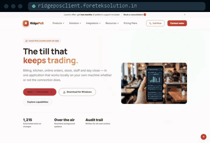
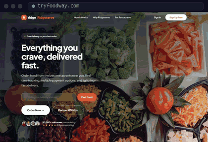
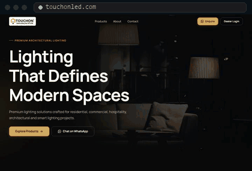
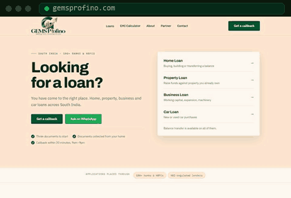

  
  
  
  

Full stack developer (**Go · Flutter · Next.js · Node.js**) and final-year B.Tech AI & Data Science student in Chennai. I find my own clients and ship their products end to end — **four are live in production right now.** Open to full-time Software Engineer / Full Stack / Backend / Flutter roles.

### 🟢 Live work

<table>
  <tr>
    <td width="50%" valign="top">
      
       <b>RidgePoS</b> — offline-first point of sale for restaurants and retail. Desktop till, <a href="https://ridgepos.foreteksolution.in/">owner dashboard</a> and <a href="https://ridgeposadmin.foreteksolution.in/">licensing console</a>; secure OTA updates with rollback.
       Flutter · Riverpod · Drift/SQLite · Go · TypeScript
    </td>
    <td width="50%" valign="top">
      
       <b>Ridgeserve</b> — DoorDash-style food delivery marketplace: customer, restaurant, driver and admin apps, 150+ API endpoints, live GPS tracking, 395+ tests.
       Go · SolidJS · PostgreSQL · Docker
    </td>
  </tr>
  <tr>
    <td width="50%" valign="top">
      
       <b>Touchon LED</b> — client website for an architectural lighting brand.
       Next.js · TypeScript · SEO
    </td>
    <td width="50%" valign="top">
      
       <b>GEMS Profino</b> — client website for a loan advisory: product pages, EMI calculator, lead forms.
       HTML · CSS · JavaScript · Vercel
    </td>
  </tr>
</table>

> Most of this is client work, so the source lives in private repositories. Happy to walk through the code in an interview.

### 🟠 Building now

| | |
|---|---|
| **EcomHub** | Multi-tenant e-commerce SaaS, Shopify-style — storefront + admin per shop, plugin registry, GST, Razorpay payments and refunds, multi-seller marketplace · *Go, Next.js, PostgreSQL* |
| **Pathshala** | White-label learning platform for coaching institutes — branded Flutter app and web portal per institute, OpenAPI contract, CI gate · *Go, Flutter, Next.js, Redis* |
| **AbhiDesk** | AnyDesk-style remote desktop over WebRTC with a Go signaling server and built-in STUN/TURN · *Go, TypeScript, Electron* |

### 🧰 Stack

                   

### 📈 Shipping every week

<picture>
  <source media="(prefers-color-scheme: dark)" srcset="https://raw.githubusercontent.com/abhi15072004/abhi15072004/output/snake-dark.svg">
  <source media="(prefers-color-scheme: light)" srcset="https://raw.githubusercontent.com/abhi15072004/abhi15072004/output/snake-light.svg">
  
</picture>

🏆 First Prize, NEURA '25 AI Hackathon · Full Stack Intern, Foretek Solution and Services (2026) · Java Full Stack Intern, InternPro (2025) · B.Tech AI & DS, CGPA 8.0
